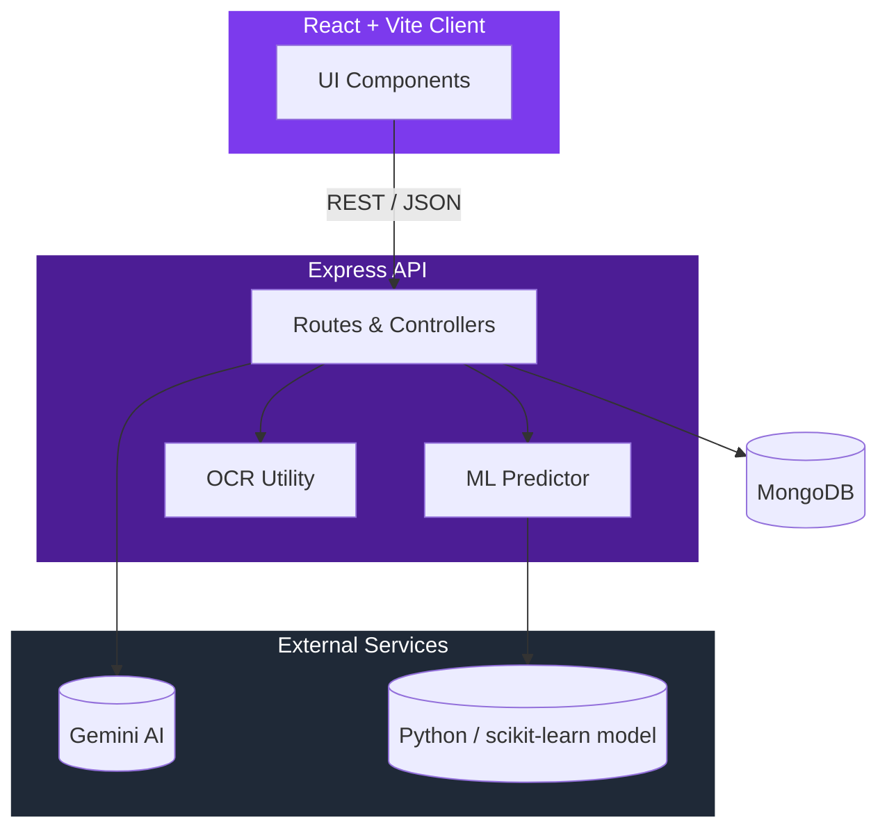

<a name="top"></a>
<div align="center">


<a href="https://github.com/divyanshAg04/DecisionVault">
  
</a>

<br/>

<!-- tech badges -->


<br/><br/>

<a href="https://decision-vault-inky.vercel.app/">
  
</a>
<a href="https://collegevault-backend.onrender.com/api">
  
</a>

<br/><br/>

<!-- live repo badges -->


</div>


## Live Deployment

- Frontend: https://decision-vault-inky.vercel.app/
- Backend API: https://collegevault-backend.onrender.com/api

<br/>

A full-stack MERN application built around **CollegeVault**, its flagship module for Indian college admissions. It turns scattered research — cutoff trends, placement data, pros and cons, gut feelings — into a structured, evidence-backed decision, complemented by an AI research summarizer and counselor, and a built-in reflection loop for after the decision is made.

<br/>

## 📑 Table of Contents

- [Why DecisionVault](#-why-decisionvault)
- [Features](#-features)
- [How It Works](#-how-it-works)
- [Tech Stack](#-tech-stack)
- [Architecture](#-architecture)
- [Getting Started](#-getting-started)
- [Train the ML Models](#-train-the-ml-models)
- [Docker](#-docker)
- [API Reference](#-api-reference)
- [Available Scripts](#-available-scripts)
- [Roadmap](#-roadmap)
- [Contributing](#-contributing)
- [License](#-license)

<br/>

## 💡 Why DecisionVault

College admission decisions are usually made across a dozen browser tabs, a few screenshots, and a half-remembered conversation with a senior. DecisionVault replaces that chaos with one structured workspace.

| | The old way | With DecisionVault |
|---|---|---|
| **Evidence** | Scattered across tabs, chats, and screenshots | Centralized evidence trail per college |
| **Fit** | Gut feeling | Explainable fit score with a contribution breakdown |
| **Cutoffs & placements** | Hunting through forums and PDFs | Dataset-backed prediction, one click |
| **Research** | Hours of manual reading | Gemini-powered summaries and Q&A |
| **After the decision** | Forgotten | Built-in reflection loop |

<br/>

## ✨ Features

<details open>
<summary><b>Core Workflow</b></summary>
<br/>

- Login/register flow with a seeded demo account
- Admissions profile onboarding for both Class 12 planning and entrance-result workflows
- College discovery with explainable fit scoring and contribution breakdowns
- Shortlist comparison with evidence links, notes, pros/cons, and an audit timeline
- Priority matrix with what-if presets
- Final decision lock with a post-admission reflection loop

</details>

<details>
<summary><b>Intelligence Layer</b></summary>
<br/>

- Gemini-backed research summarizer and Q&A counselor, with graceful fallback parsing if the API is unavailable
- JEE cutoff dataset matching against rank and category input
- Placement probability and package forecasting from a real student placement dataset (Python/scikit-learn model with a lightweight JS fallback)
- OCR utility (Tesseract.js) for pulling text out of evidence screenshots

</details>

<details>
<summary><b>Platform & Security</b></summary>
<br/>

- JWT auth via HttpOnly cookies
- Rate limiting, Helmet, and Zod-validated input on every route
- Light/dark theme
- Docker Compose setup for one-command local environments

</details>

<br/>

## 🔄 How It Works

```mermaid
flowchart LR
    A[Onboarding] --> B[College Discovery & Fit Scoring]
    B --> C[Shortlist + Evidence + Notes]
    C --> D[Priority Matrix & What-Ifs]
    D --> E[AI Counselor & Research Summaries]
    E --> F[Admission & Placement Predictions]
    F --> G[Final Decision Lock]
    G --> H[Post-Admission Reflection]

    style A fill:#7C3AED,color:#fff,stroke:none
    style B fill:#6D28D9,color:#fff,stroke:none
    style C fill:#5B21B6,color:#fff,stroke:none
    style D fill:#4C1D95,color:#fff,stroke:none
    style E fill:#5B21B6,color:#fff,stroke:none
    style F fill:#6D28D9,color:#fff,stroke:none
    style G fill:#7C3AED,color:#fff,stroke:none
    style H fill:#8B5CF6,color:#fff,stroke:none
```



<br/>

## 🛠 Tech Stack

<div align="center">


</div>

<br/>

| Layer | Technology |
|---|---|
| Frontend | React 19, Vite, Lucide Icons |
| Backend | Node.js, Express |
| Database | MongoDB + Mongoose |
| Auth | JWT (HttpOnly cookies), bcryptjs |
| Validation / Security | Zod, Helmet, express-rate-limit, CORS |
| AI | Google Gemini (summarizer + counselor) |
| ML | Python (scikit-learn) for classification/regression, JS fallback model |
| OCR | Tesseract.js |
| Infra | Docker Compose, Nginx (client container) |

<br/>

## 🏗 Architecture



<br/>

## 🚀 Getting Started

### Prerequisites

- Node.js 18+
- MongoDB running locally, or a MongoDB Atlas connection string
- Python 3 (only required to train/run the scikit-learn placement model)
- Optional: a Gemini API key for live AI responses

> [!TIP]
> No Gemini key? The app still runs — AI summaries and the counselor fall back to a lightweight parser instead of failing.

### Installation

```bash
git clone https://github.com/divyanshAg04/DecisionVault.git
cd DecisionVault
npm run install:all
```

### Environment Variables

<details>
<summary>Click to expand environment setup</summary>
<br/>

Copy `server/.env.example` to `server/.env`:

```env
PORT=5000
MONGO_URI=mongodb://127.0.0.1:27017/decisionvault
JWT_SECRET=replace-with-a-long-random-secret
CLIENT_ORIGIN=http://localhost:5173
GEMINI_API_KEY=your-gemini-api-key-here
NODE_ENV=development
PYTHON_BIN=
```

For the client, copy `client/.env.example` to `client/.env` if the API isn't at `http://localhost:5000/api`, and set `VITE_API_URL` accordingly.

For Docker Compose, copy the root `.env.example` to `.env` and set at least `JWT_SECRET` — Compose reads the root `.env`, not `server/.env`.

</details>

### Seed Data

```bash
npm run seed          # demo colleges, demo user, starter shortlists
npm run seed:cutoffs  # JEE cutoff rows for the predictive matcher
npm run seed:all      # both of the above
```

If the datasets aren't present yet:

```bash
npm run datasets
```

> [!NOTE]
> Demo login: `demo@decisionvault.dev` / `Password123`

### Run Locally

```bash
npm run dev
```

- Client → `http://localhost:5173`
- API → `http://localhost:5000/api`
- Health check → `curl http://localhost:5000/api/health`

<br/>

## 🤖 Train the ML Models

```bash
cd server
pip install -r requirements.txt
npm run train:ml
```

This trains and saves the best classifier/regressor to `server/models/`. The API contract at `/api/ml/predict-placement` stays the same regardless — it uses the trained scikit-learn bundle when available and falls back to the lightweight JS model otherwise.

Latest trained metrics:

```text
Classification: Accuracy 1.0000, Precision 1.0000, Recall 1.0000, F1 1.0000, ROC-AUC 1.0000
Regression:     R2 0.8483, MAE 0.6753, RMSE 1.4948, MSE 2.2344
```

> [!WARNING]
> This app is built for decision support. Cutoff and placement predictions are estimates, not guarantees of admission or placement outcomes.

<br/>

## 🐳 Docker

```bash
cp .env.example .env
docker compose up --build
```

The client container serves the production React build through Nginx, with a fallback so refreshed deep routes still resolve to `index.html`.

<br/>

## 📡 API Reference

<details>
<summary>Click to expand the full route table</summary>
<br/>

| Method | Endpoint | Description |
|---|---|---|
| POST | `/api/auth/register` | Create an account |
| POST | `/api/auth/login` | Log in |
| POST | `/api/auth/logout` | Log out |
| GET | `/api/auth/me` | Get current session user |
| PATCH | `/api/auth/profile` | Update profile |
| GET | `/api/colleges` | Browse/search colleges |
| POST | `/api/shortlists` | Manage shortlist entries |
| GET | `/api/activities` | Audit timeline |
| POST | `/api/ai/summarize` | Gemini research summarizer |
| POST | `/api/ai/ask` | Gemini Q&A counselor |
| POST | `/api/ml/predict-admission` | Admission likelihood prediction |
| POST | `/api/ml/predict-placement` | Placement/package prediction |
| POST | `/api/decisions` | Lock in a final decision |
| POST | `/api/decisions/reflections` | Record a post-admission reflection |

Most application routes require an authenticated session cookie.

</details>

<br/>

## 📜 Available Scripts

Run from the project root:

| Script | Description |
|---|---|
| `npm run dev` | Run client + API concurrently |
| `npm run install:all` | Install root, client, and server dependencies |
| `npm run datasets` | Download the CSV datasets |
| `npm run seed` / `seed:cutoffs` / `seed:all` | Seed demo and cutoff data |
| `npm run train:ml` | Train the scikit-learn placement model |
| `npm run build` | Build the client for production |
| `npm start` | Start the production server |

<br/>

## 🗺 Roadmap

Ideas worth exploring next:

- [ ] Automated test suite (Jest / Supertest)
- [ ] CI pipeline for lint, test, and build checks
- [ ] CSV/JSON export for shortlists and decisions
- [ ] Multi-user collaboration on a single shortlist
- [ ] Mobile-first PWA mode

<br/>

## 🤝 Contributing

Contributions are welcome.

1. Fork the repository
2. Create a branch: `git checkout -b feat/your-feature`
3. Commit your changes with a clear message
4. Open a pull request describing what changed and why

<br/>

## 📄 License

Distributed under the [MIT License](LICENSE). © 2026 Divyansh Agrawal.

<br/>

<div align="center">

If this project helped you, consider giving it a ⭐ — it genuinely helps.

<a href="#top">⬆ Back to top</a>


</div>
