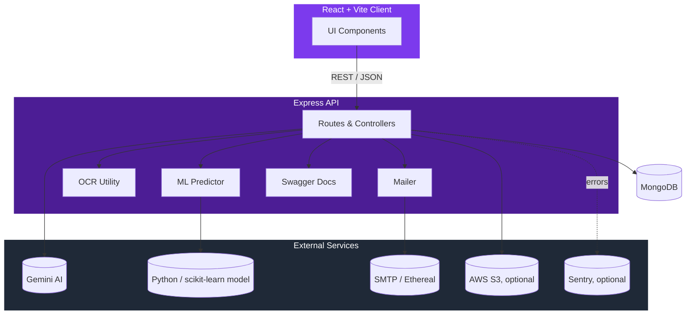

<a name="top"></a>
<div align="center">


<a href="https://github.com/divyanshAg04/DecisionVault">
  
</a>

<br/>

<!-- tech badges -->


<br/><br/>

<a href="https://decision-vault-inky.vercel.app/">
  
</a>
<a href="https://collegevault-backend.onrender.com/api">
  
</a>

<br/><br/>

</div>


## Live Deployment

- Frontend: https://decision-vault-inky.vercel.app/
- Backend API: https://collegevault-backend.onrender.com/api

<br/>

A full-stack MERN application built around **CollegeVault**, its flagship module for Indian college admissions. It turns scattered research — cutoff trends, placement data, pros and cons, gut feelings — into a structured, evidence-backed decision, complemented by an AI research summarizer and counselor, and a built-in reflection loop for after the decision is made.

<br/>

## 📑 Table of Contents

- [Why DecisionVault](#-why-decisionvault)
- [Features](#-features)
- [How It Works](#-how-it-works)
- [Tech Stack](#-tech-stack)
- [Architecture](#-architecture)
- [Getting Started](#-getting-started)
- [Train the ML Models](#-train-the-ml-models)
- [Docker](#-docker)
- [API Reference](#-api-reference)
- [Available Scripts](#-available-scripts)
- [Testing](#-testing)
- [Design Decisions](#-design-decisions)
- [Roadmap](#-roadmap)
- [Contributing](#-contributing)

<br/>

## 💡 Why DecisionVault

College admission decisions are usually made across a dozen browser tabs, a few screenshots, and a half-remembered conversation with a senior. DecisionVault replaces that chaos with one structured workspace.

| | The old way | With DecisionVault |
|---|---|---|
| **Evidence** | Scattered across tabs, chats, and screenshots | Centralized evidence trail per college |
| **Fit** | Gut feeling | Explainable fit score with a contribution breakdown |
| **Cutoffs & placements** | Hunting through forums and PDFs | Dataset-backed prediction, one click |
| **Research** | Hours of manual reading | Gemini-powered summaries and Q&A |
| **After the decision** | Forgotten | Built-in reflection loop |

<br/>

## ✨ Features

<details open>
<summary><b>Core Workflow & Premium UI</b></summary>
<br/>

- **Interactive Case File Preview**: Hero section with a tabbed college selection and an **animated SVG radar chart** (features rotating sweep, pulsing vertices, and expanding sonar ripples)
- **Visual Stepper Timeline**: Sequenced onboarding workflow (`01`–`04`) with card number watermarks and responsive visual connectors
- **Dual-Theme Login Portal**: Fully redesigned login panel adapting natively between light dashboard card theme and cosmic radial-gradient dark theme
- **Adaptive Journey Selection**: Option cards for onboarding tracks with custom hover lift and purple glow highlights
- Onboarding for both Class 12 planning and entrance-result admissions workflows
- College discovery with explainable fit scoring, contribution breakdowns, and server-side result caching
- Shortlist comparison with evidence links, notes, pros/cons, and an audit timeline
- Priority matrix with what-if presets
- Final decision lock with a post-admission reflection loop
- CSV/JSON export for shortlists and locked decisions

</details>

<details>
<summary><b>Intelligence Layer</b></summary>
<br/>

- Gemini-backed research summarizer and Q&A counselor, with graceful fallback parsing if the API is unavailable
- JEE cutoff dataset matching against rank and category input
- Placement probability and package forecasting from a real student placement dataset (Python/scikit-learn model with a lightweight JS fallback)
- OCR utility (Tesseract.js) for pulling text out of evidence screenshots

</details>

<details>
<summary><b>Platform, Auth & Security</b></summary>
<br/>

- JWT auth via HttpOnly cookies, with short-lived access tokens and a rotating refresh-token flow
- Email verification on signup (OTP-based, resend supported), with an Ethereal preview link when no SMTP provider is configured
- Rate limiting, Helmet, and Zod-validated input on every route
- Structured logging (Pino) and optional Sentry error tracking for production
- Optional AWS S3 storage for uploaded scorecards, with automatic fallback to local disk when S3 isn't configured
- Self-serve account deletion that transactionally removes all related records
- Auto-generated Swagger/OpenAPI docs at `/api/docs`
- **Dynamic Light/Dark Theme**: Cohesive dark-theme cosmic gradients and clean white dashboard styling throughout the application
- Docker Compose setup for one-command local environments

</details>

<br/>

> [!NOTE]
> A collaboration layer (shared workspaces, invite-a-collaborator, viewer/editor roles) is scaffolded on both ends — the `Invitation` model, activity-log event types, and invite email template exist on the backend, and the client already has UI and API-client calls wired up for it. The corresponding `/api/collaborators/*` routes aren't mounted on the server yet, so this feature isn't functional in the current build. See [Roadmap](#-roadmap).

<br/>

## 🔄 How It Works


```mermaid
flowchart LR
    A[Onboarding] --> B[College Discovery & Fit Scoring]
    B --> C[Shortlist + Evidence + Notes]
    C --> D[Priority Matrix & What-Ifs]
    D --> E[AI Counselor & Research Summaries]
    E --> F[Admission & Placement Predictions]
    F --> G[Final Decision Lock]
    G --> H[Post-Admission Reflection]

    style A fill:#7C3AED,color:#fff,stroke:none
    style B fill:#6D28D9,color:#fff,stroke:none
    style C fill:#5B21B6,color:#fff,stroke:none
    style D fill:#4C1D95,color:#fff,stroke:none
    style E fill:#5B21B6,color:#fff,stroke:none
    style F fill:#6D28D9,color:#fff,stroke:none
    style G fill:#7C3AED,color:#fff,stroke:none
    style H fill:#8B5CF6,color:#fff,stroke:none
```

<br/>

## 🛠 Tech Stack

<div align="center">


</div>

<br/>

| Layer | Technology |
|---|---|
| Frontend | React 19, Vite, Lucide Icons |
| Backend | Node.js, Express |
| Database | MongoDB + Mongoose |
| Auth | JWT (HttpOnly cookies) + refresh tokens, bcryptjs, OTP email verification |
| Validation / Security | Zod, Helmet, express-rate-limit, CORS |
| AI | Google Gemini (summarizer + counselor) |
| ML | Python (scikit-learn, XGBoost) for classification/regression, JS fallback model |
| OCR | Tesseract.js |
| Email | Nodemailer (SMTP in production, Ethereal preview in dev) |
| Storage | AWS S3 (optional) with local-disk fallback |
| Observability | Pino structured logging, Sentry (optional) |
| API Docs | swagger-jsdoc + swagger-ui-express (`/api/docs`) |
| Testing | Vitest, Supertest, mongodb-memory-server, Testing Library |
| Infra | Docker Compose, Nginx (client container) |

<br/>

## 🏗 Architecture


```mermaid
flowchart TB
    subgraph Client["React + Vite Client"]
        UI[UI Components]
    end

    subgraph Server["Express API"]
        Routes[Routes & Controllers]
        ML[ML Predictor]
        OCR[OCR Utility]
        Mailer[Mailer]
        Docs[Swagger Docs]
    end

    subgraph External["External Services"]
        Gemini[(Gemini AI)]
        Sklearn[(Python / scikit-learn model)]
        SMTP[(SMTP / Ethereal)]
        S3[(AWS S3, optional)]
        Sentry[(Sentry, optional)]
    end

    DB[(MongoDB)]

    UI -- REST / JSON --> Routes
    Routes --> DB
    Routes --> ML
    ML --> Sklearn
    Routes --> Gemini
    Routes --> OCR
    Routes --> Mailer
    Mailer --> SMTP
    Routes --> S3
    Routes -.errors.-> Sentry
    Routes --> Docs

    style Client fill:#7C3AED,color:#fff,stroke:none
    style Server fill:#4C1D95,color:#fff,stroke:none
    style External fill:#1F2937,color:#fff,stroke:none
```

<br/>

## 🚀 Getting Started

### Prerequisites

- Node.js 18+
- MongoDB running locally, or a MongoDB Atlas connection string
- Python 3 (only required to train/run the scikit-learn placement model)
- Optional: a Gemini API key for live AI responses

> [!TIP]
> No Gemini key? The app still runs — AI summaries and the counselor fall back to a lightweight parser instead of failing. The same applies to SMTP, S3, and Sentry: each is optional and degrades gracefully.

### Installation

```bash
git clone https://github.com/divyanshAg04/DecisionVault.git
cd DecisionVault
npm run install:all
```

### Environment Variables

<details>
<summary>Click to expand environment setup</summary>
<br/>

Copy `server/.env.example` to `server/.env`:

```env
PORT=5000
MONGO_URI=mongodb://127.0.0.1:27017/decisionvault
JWT_SECRET=replace-with-a-long-random-secret
CLIENT_ORIGIN=http://localhost:5173
GEMINI_API_KEY=your-gemini-api-key-here
NODE_ENV=development
PYTHON_BIN=

# Optional: Sentry error tracking (leave blank to disable)
SENTRY_DSN=

# Optional: SMTP email for verification emails (leave blank to use Ethereal in dev)
SMTP_HOST=
SMTP_PORT=587
SMTP_USER=
SMTP_PASS=
SMTP_FROM="DecisionVault" <noreply@decisionvault.dev>

# Optional in development, but required for production; without them, uploaded evidence files will not persist across deploys (uses ephemeral local /public/uploads fallback)
AWS_ACCESS_KEY_ID=
AWS_SECRET_ACCESS_KEY=
AWS_S3_BUCKET=
AWS_REGION=ap-south-1
```

For the client, copy `client/.env.example` to `client/.env` if the API isn't at `http://localhost:5000/api`, and set `VITE_API_URL` accordingly. Production builds require `VITE_API_URL`; if it is missing, the app shows a configuration error instead of falling back to localhost.

For Docker Compose, copy the root `.env.example` to `.env` and set at least `JWT_SECRET` — Compose reads the root `.env`, not `server/.env`.

</details>

### Seed Data

```bash
npm run seed          # demo colleges, demo user, starter shortlists
npm run seed:cutoffs  # JEE cutoff rows for the predictive matcher
npm run seed:all      # both of the above
```

`npm run seed` upserts the demo colleges and resets only the demo account (`demo@decisionvault.dev`), so existing non-demo users and their decision records are left alone.

If the datasets aren't present yet:

```bash
npm run datasets
```

> [!NOTE]
> Demo login: `demo@decisionvault.dev` / `Password123`

### Run Locally

```bash
npm run dev
```

- Client → `http://localhost:5173`
- API → `http://localhost:5000/api`
- Health check → `curl http://localhost:5000/api/health`
- Swagger docs → `http://localhost:5000/api/docs`

<br/>

## 🤖 Train the ML Models

```bash
cd server
pip install -r requirements.txt
npm run train:ml
```

This trains and saves the best classifier/regressor to `server/models/`. The API contract at `/api/ml/predict-placement` stays the same regardless — it uses the trained scikit-learn bundle when available and falls back to the lightweight JS model otherwise.

Latest trained metrics:

```text
Classification: Accuracy 1.0000, Precision 1.0000, Recall 1.0000, F1 1.0000, ROC-AUC 1.0000
Regression:     R2 0.8483, MAE 0.6753, RMSE 1.4948, MSE 2.2344
```

> [!IMPORTANT]
> **Dataset and Predictability Disclaimer:**
> These metrics are computed on synthetic, rule-generated data (`Indian_Student_Placement_Dataset_2025.csv`) and reflect pattern-fitting of the underlying deterministic rules, not validated real-world predictive accuracy. No independent real-world out-of-sample holdout validation has been performed.

> [!WARNING]
> This app is built for decision support. Cutoff and placement predictions are estimates, not guarantees of admission or placement outcomes.

<br/>

## 🐳 Docker

```bash
cp .env.example .env
docker compose up --build
```

The client container serves the production React build through Nginx, with a fallback so refreshed deep routes still resolve to `index.html`.

<br/>

## 📡 API Reference

<details>
<summary>Click to expand the full route table</summary>
<br/>

The full interactive spec is also available at [`/api/docs`](https://collegevault-backend.onrender.com/api/docs) (Swagger UI).

| Method | Endpoint | Description |
|---|---|---|
| GET | `/api/health` | Service and database health check |
| POST | `/api/auth/register` | Create an account (triggers email verification) |
| ALL | `/api/auth/verify-email` | Verify an account via OTP |
| POST | `/api/auth/resend-verification` | Resend the verification email |
| POST | `/api/auth/login` | Log in |
| POST | `/api/auth/logout` | Log out |
| POST | `/api/auth/refresh` | Rotate an access token using the refresh token |
| GET | `/api/auth/me` | Get current session user |
| PATCH | `/api/auth/profile` | Update profile |
| DELETE | `/api/auth/account` | Delete account and all related records (transactional) |
| GET | `/api/colleges` | Browse/search colleges (filterable, cached) |
| GET | `/api/colleges/:id` | Get a single college |
| GET | `/api/shortlists` | List shortlist entries |
| GET | `/api/shortlists/export` | Export shortlist as CSV/JSON |
| POST | `/api/shortlists` | Add a college to the shortlist |
| POST | `/api/shortlists/prediction` | Get admission/placement prediction for a shortlist entry |
| POST | `/api/shortlists/:id/notes` | Add a note to a shortlist entry |
| DELETE | `/api/shortlists/:id/notes/:noteId` | Remove a note |
| PATCH | `/api/shortlists/:id/status` | Update shortlist entry status |
| DELETE | `/api/shortlists/:id` | Remove a shortlist entry |
| GET | `/api/decisions` | List locked decisions |
| GET | `/api/decisions/export` | Export decisions as CSV/JSON |
| GET | `/api/decisions/:id/export` | Export a single decision as CSV/JSON |
| POST | `/api/decisions` | Lock in a final decision |
| POST | `/api/decisions/reflections` | Record a post-admission reflection |
| GET | `/api/activities` | Audit timeline (last 50 events) |
| POST | `/api/ai/summarize` | Gemini research summarizer |
| POST | `/api/ai/ask` | Gemini Q&A counselor |
| POST | `/api/ml/predict-admission` | Admission likelihood prediction |
| POST | `/api/ml/predict-placement` | Placement/package prediction |

Most application routes require an authenticated session cookie (or bearer token).

</details>

<br/>

## 📜 Available Scripts

Run from the project root:

| Script | Description |
|---|---|
| `npm run dev` | Run client + API concurrently |
| `npm run install:all` | Install root, client, and server dependencies |
| `npm run datasets` | Download the CSV datasets |
| `npm run seed` / `seed:cutoffs` / `seed:all` | Seed demo and cutoff data |
| `npm run train:ml` | Train the scikit-learn placement model |
| `npm run build` | Build the client for production |
| `npm start` | Start the production server |

<br/>

## ✅ Testing

```bash
# Server (Vitest + Supertest, in-memory MongoDB via mongodb-memory-server)
cd server && npm test

# Client (Vitest + Testing Library, jsdom)
cd client && npm test
```

Server tests cover auth, refresh tokens, email verification, transactional account deletion, AI routes, ML routes, shortlists, and the logger.

### 🎭 End-to-End (E2E) Tests

We use Playwright to verify the core user journey (login, discovery search, shortlisting, adding research notes, prioritizations, and confirming decisions).

To set up and run E2E tests locally:
1. Install E2E dependencies and browser binaries:
   ```bash
   cd e2e
   npm install
   npx playwright install chromium
   cd ..
   ```
2. Run the E2E test suite (which automatically seeds the database with demo data, boots the local dev server, runs the tests, and shuts down):
   ```bash
   npm run e2e
   ```

<br/>

## 🛡 Design Decisions

### 1. Cryptographic Security (BCrypt Cost Factor)
We employ `bcryptjs` with a work factor of `12` for password hashing. This choice balances security and server performance. It ensures high computational complexity to thwart GPU-based brute-force attacks while keeping authentication latency under 300ms on standard CPUs.

### 2. Session Security (HttpOnly Cookies vs LocalStorage)
To store JSON Web Tokens (JWTs), we strictly use `httpOnly` secure cookies with `sameSite: 'lax'` (or `none` in production cross-origin setups). This setup prevents client-side Javascript from reading the token, offering robust protection against Cross-Site Scripting (XSS) token-theft attacks.

### 3. AI Robustness (Gemini Timeout & Rule-Based Fallback)
Our Admissions Counselor and Research Summarizer invoke Google's Gemini API with an `AbortController` timeout capped at `10 seconds`. If Google's API hangs or is unavailable, the application falls back gracefully to a deterministic rule-based NLP parser, guaranteeing 100% uptime and high availability.

### 4. Database Consistency (Transaction-Based Account Deletion)
When a user deletes their account, we execute deletions across all relational collections (`Shortlists`, `Decisions`, `Reflections`, `ActivityLogs`, `Users`) inside a session transaction (`session.withTransaction()`). This guarantees database integrity by ensuring partial write failures trigger a complete rollback rather than leaving orphaned data.

### 5. Graceful Degradation for Third-Party Integrations
SMTP, AWS S3, and Sentry are all optional at the environment-variable level. Missing SMTP credentials fall back to an Ethereal preview link (and a local `invite_debug.txt`/console log in dev); a missing S3 bucket falls back to local disk under `public/uploads`; a missing Sentry DSN simply skips initialization. The app is designed to run fully offline-capable in development with zero third-party credentials.

<br/>

## 🗺 Roadmap

Ideas worth exploring next:

- [x] Automated test suite (Vitest / Supertest / MongoMemoryReplSet)
- [x] CSV/JSON export for shortlists and decisions
- [ ] Wire up `/api/collaborators/*` routes to finish multi-user collaboration (model, mailer, and client UI already exist)
- [ ] CI pipeline for lint, test, and build checks on every PR
- [ ] Mobile-first PWA mode

<br/>

## 🤝 Contributing

Contributions are welcome.

1. Fork the repository
2. Create a branch: `git checkout -b feat/your-feature`
3. Commit your changes with a clear message
4. Open a pull request describing what changed and why

<br/>

<div align="center">

If this project helped you, consider giving it a ⭐ — it genuinely helps.

<a href="#top">⬆ Back to top</a>


</div>
